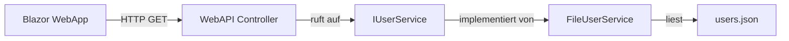

# Projektdokumentation

## 1. Übersicht
Diese Anwendung ist ein modulares Benutzerverwaltungssystem, bestehend aus einem **Blazor WebAssembly Frontend** und einer **ASP.NET Core WebAPI**. Ziel ist es, Benutzer zu suchen, in Tabs zu öffnen und Detailinformationen anzuzeigen.

**Technologie-Stack**
- .NET 9 (C#)
- Blazor WebAssembly (Client)
- ASP.NET Core WebAPI (Server)
- Architektur: Repository Pattern (Entkopplung von Logik und Datenquelle)

---

## 2. Architektur & Datenfluss
Die Anwendung folgt einer klaren Schichtung ("Clean Architecture Light"), sodass die Datenquelle später problemlos austauschbar ist (z. B. JSON → Microsoft Graph).

---

## 3. Komponente: Shared Library (Application)
Diese Bibliothek wird sowohl vom Frontend als auch vom Backend genutzt, um Typsicherheit zu gewährleisten.

### User.cs
- Zentrales Datenmodell
- `Id` ist ein `string`, um GUIDs aus Azure AD / Microsoft Graph zu unterstützen
- Enthält u. a.:
  - IdentificationNumber
  - Faculty
  - Role
  - Department

### IUserService.cs
Definiert den Vertrag für den Datenzugriff:

- `SearchAsync(string term)` – Sucht Benutzer
- `GetByIdAsync(string id)` – Lädt einen Benutzer anhand der ID

---

## 4. Komponente: Backend (WebAPI)
Die WebAPI stellt die Daten bereit und ist vollständig von der Datenquelle entkoppelt.

### Program.cs
- Konfiguration von CORS (Zugriff aus Blazor)
- Dependency Injection für den aktiven User-Service

### Controllers/UserController.cs
- REST-Endpunkte:
  - `GET api/user?term=...`
  - `GET api/user/{id}`
- Nutzt ausschließlich `IUserService`

### Services
- **FileUserService**: Liest Benutzerdaten aus `users.json`
- **GraphUserService**: Vorbereitung für Microsoft Graph Integration

### users.json
- Mock-Datenbank für Entwicklungs- und Testzwecke

---

## 5. Komponente: Frontend (Web)
Das Benutzerinterface läuft vollständig im Browser.

### AppState.cs
- Globaler Anwendungszustand
- Verwaltung offener Tabs
- Persistenz via `localStorage`
- Maximal 8 offene Tabs (ältester wird automatisch geschlossen)

### NavMenu.razor
- Suchleiste mit Live-Suche über die API
- Anzeige und Verwaltung offener Tabs

### UserDetail.razor
- Anzeige von Benutzerdetails
- Dynamisches Nachladen bei Tab-Wechsel (`OnParametersSetAsync`)
